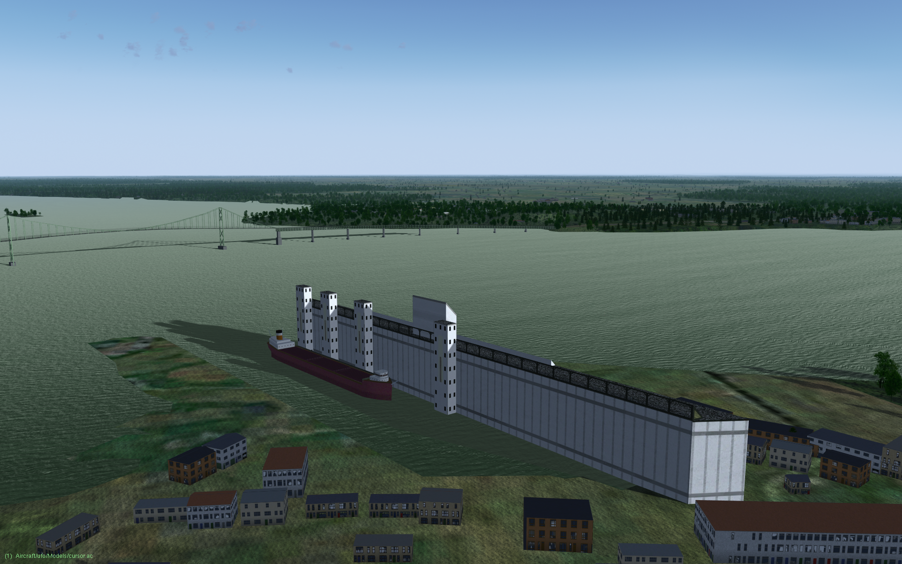

Blender model of the Johnstown Grain Elevator
=============================================

This is a Public Domain, low-polygon model of the Johnston, ON grain elevator, a prominent visual landmark along the St. Lawrence River.  The model is designed for the open-source [FlightGear](https://flightgear.org) flight simulator, but you are free to use it wherever you'd like.

Closest airport: [Ogdensburg International](https://ourairports.com/airports/KOGS/) (KOGS).

## UnLicense

This model is released into the Public Domain. See UNLICENSE.md for details.

## Author

Started by David Megginson, October 2024.  Attribution is appreciated, but not required.
